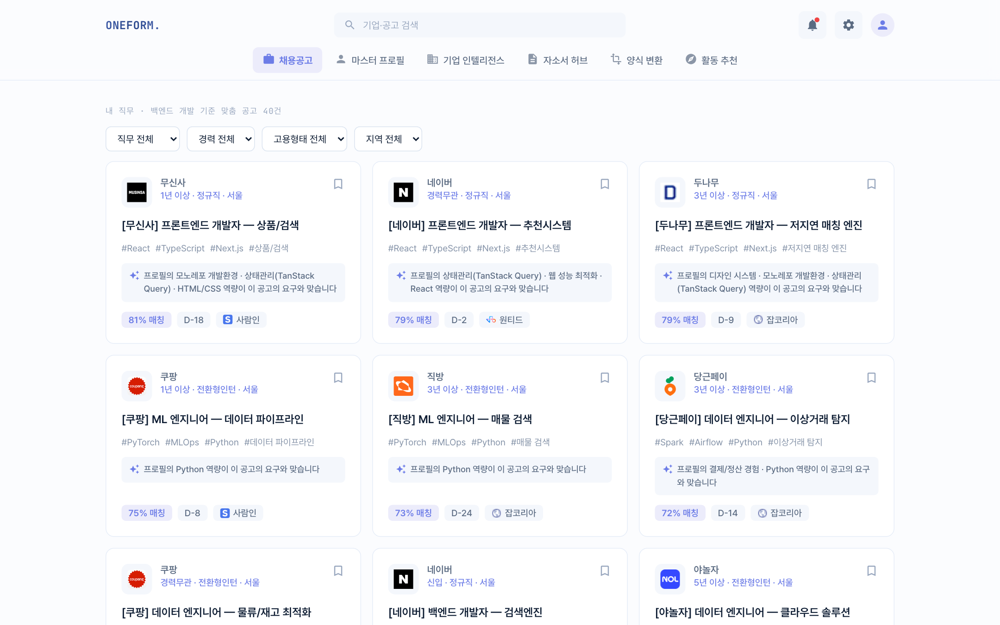
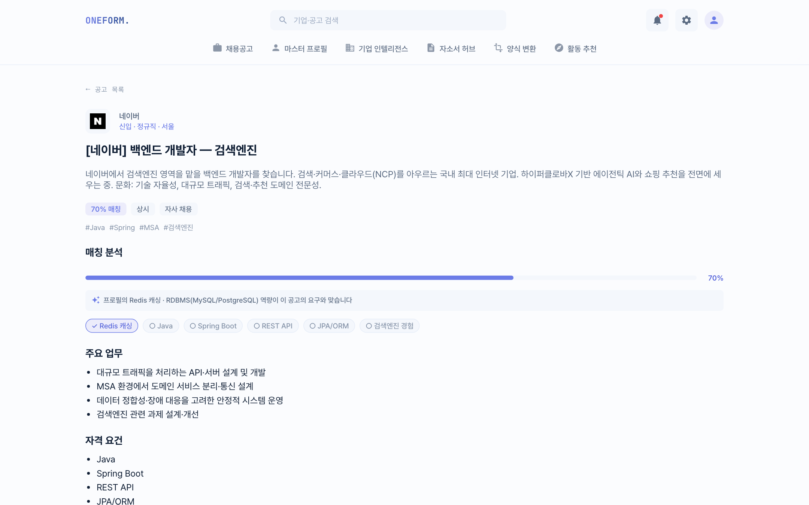
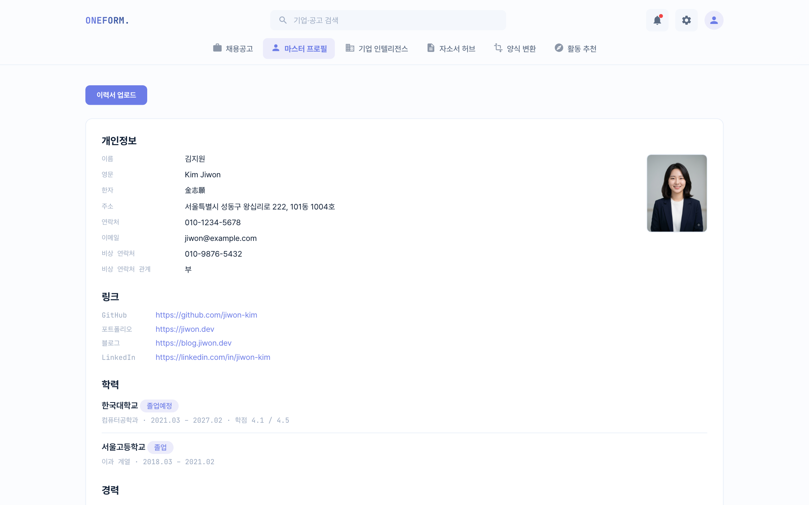
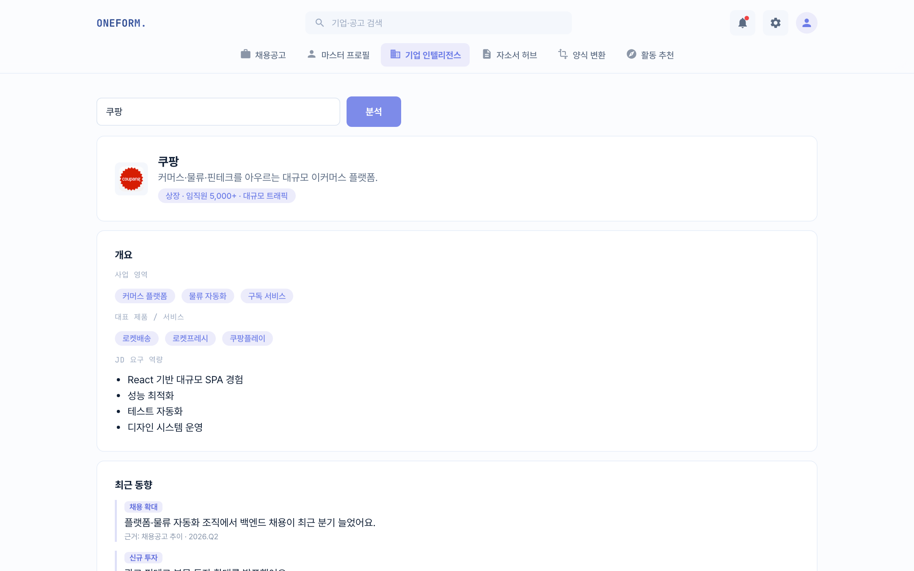
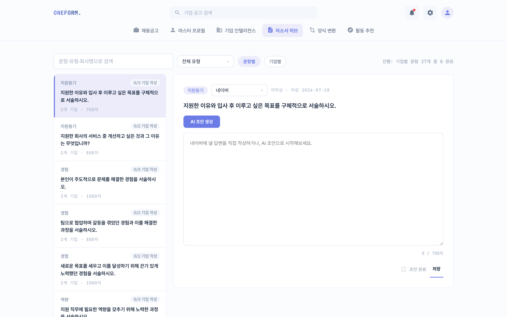
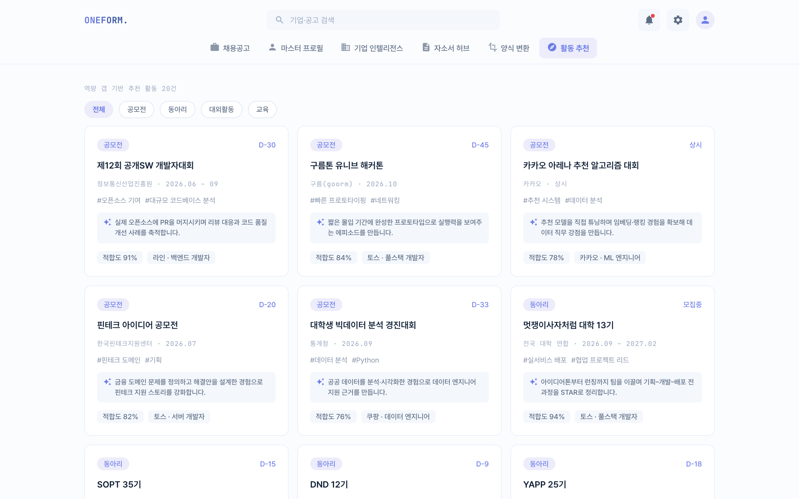
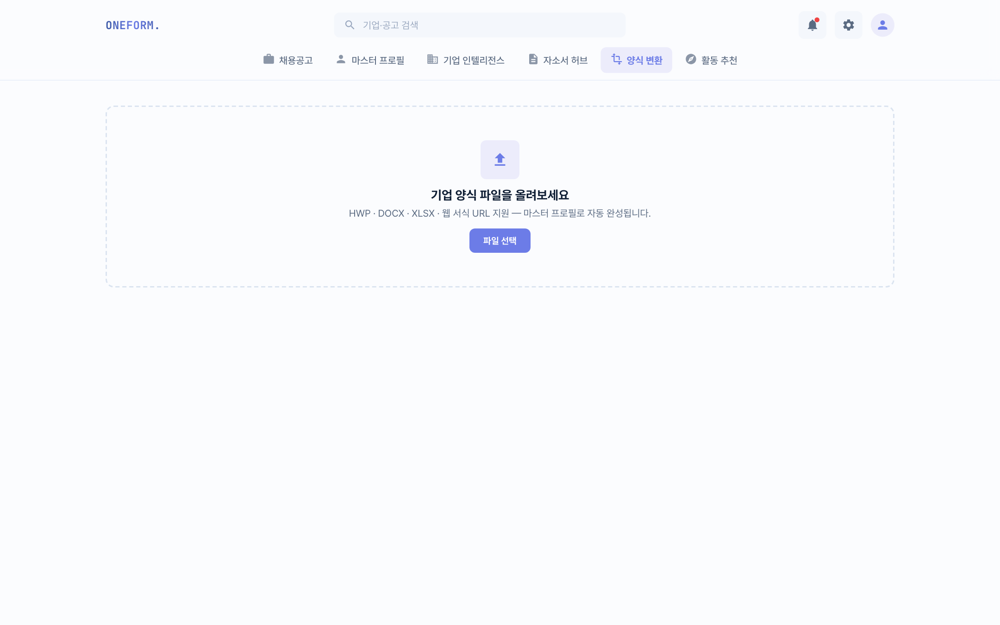
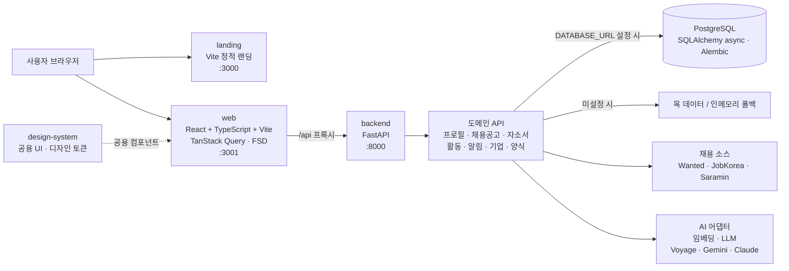

# one-form

지원서 통합 플랫폼 — Turborepo + pnpm 모노레포.

> **오픈소스 AI 서비스 엔지니어링 — Track A** 과정을 통해 만드는 프로젝트입니다.

## 학습 목표

이 프로젝트로 익히려는 것:

1. **에이전트로 지원서 통합 플랫폼 기능을 구현하고, 평가(eval)로 품질을 측정해 반복 개선한다** —
   "돌아간다"가 아니라 "얼마나 잘 하는가"를 지표로 보고 좋은 성능까지 끌어올린다.
2. **기능마다 알맞은 에이전트를 설계할 수 있다** — 어떤 도구·컨텍스트·모델·프롬프트를
   줄지 기능 성격에 맞게 판단한다.
3. **코딩 자체는 AI에게 맡기지만, 어떤 기능이 어떤 코드와 구조로 코딩되었는지 정확하게 이해한다** —
   구현은 에이전트에 위임하되 산출된 코드·아키텍처를 직접 읽고 설명할 수 있어야 한다.

## 기능

핵심 흐름은 **마스터 프로필**을 중심으로 돈다 — 이력서를 한 번 올려 STAR 경험으로
구조화하면, 이후 모든 기능이 이 프로필을 재료로 삼는다.

| 기능                | 설명                                                             |
| ------------------- | ---------------------------------------------------------------- |
| **마스터 프로필**   | 이력서 업로드 → 기본 스펙·STAR 경험으로 구조화. 모든 기능의 원천 |
| **채용공고 추천**   | 프로필↔공고를 임베딩·LLM으로 대조해 매칭률·근거 표시 + 상세페이지 |
| **기업 인텔리전스** | 기업명 입력 → 사업·최근 동향·JD 역량·강점 매칭 브리핑            |
| **자소서 허브**     | 문항(글자 수·마감) 관리 + 내 경험을 근거로 AI 초안 생성          |
| **양식 변환**       | 자사 지원 양식 업로드 → 프로필 필드로 자동 매핑                  |
| **활동 추천**       | 역량 갭을 메울 활동을 예상 경험·직무와 연결해 추천               |
| **크롬 익스텐션**   | 외부 채용 사이트의 웹 폼을 프로필로 자동 채우는 오토필 위젯      |

## 화면

**채용공고 — 매칭률·근거 (임베딩+LLM)**


**채용공고 상세 — 매칭 분석 (요구 스킬 충족/부족)**


<table>
<tr>
<td width="50%"><b>마스터 프로필</b><br></td>
<td width="50%"><b>기업 인텔리전스</b><br></td>
</tr>
<tr>
<td width="50%"><b>자소서 허브</b><br></td>
<td width="50%"><b>활동 추천</b><br></td>
</tr>
</table>

**양식 변환**


> 스크린샷은 목(mock) 데이터 기준. 채용공고 매칭은 키를 넣으면 실 임베딩·LLM으로 동작한다(아래 [AI 구현](#ai-구현-임베딩--llm) 참고).

## 구조

```
apps/
├── landing/   # 랜딩 페이지 (Vite 정적 사이트, port 3000)
├── web/       # 프론트엔드 (React + Vite + TypeScript, port 3001)
└── backend/   # 백엔드 (FastAPI + uv, port 8000)
```



- `web`은 화면과 서버 상태를 담당하고, `backend`는 도메인별 API와 매칭 로직을 담당합니다.
- PostgreSQL은 `DATABASE_URL`을 설정하면 사용하며, 개발·CI 환경에서는 목 데이터와 인메모리 캐시로 대체됩니다.
- AI·외부 채용 소스는 API 키가 있을 때 실제 어댑터를 사용하고, 없으면 결정적인 mock 구현으로 동작합니다.

## 요구 사항

- Node 22 (`nvm use` — `.nvmrc` 참고)
- pnpm 9+
- [uv](https://docs.astral.sh/uv/) (Python 패키지 매니저)

## 시작하기

```bash
nvm use
pnpm install                 # JS 의존성 (landing, web)
cd apps/backend && uv sync && cd ../..   # Python 의존성 (backend)

pnpm dev                     # 세 앱 동시 실행
```

- 랜딩: http://localhost:3000
- 웹앱: http://localhost:3001 (`/api/*` 요청은 8000번 FastAPI로 프록시됨)
- API: http://localhost:8000 (문서: http://localhost:8000/docs)

## 명령어

| 명령         | 설명                          |
| ------------ | ----------------------------- |
| `pnpm dev`   | 모든 앱 dev 서버 실행 (turbo) |
| `pnpm build` | landing + web 프로덕션 빌드   |
| `pnpm lint`  | lint 실행                     |

특정 앱만 실행하려면: `pnpm turbo dev --filter=@one-form/web`

## AI 구현 (임베딩 + LLM)

**채용공고 매칭이 실제로 구현돼 있다** — 마스터 프로필과 공고를 임베딩·LLM으로 대조해 매칭률과 근거를
낸다. 나머지 AI 기능(기업 브리핑·자소서 초안·활동 추천 등)은 아직 목(mock)이다.

**포트-어댑터 + 키 게이팅** — 인터페이스 뒤에 목/실 어댑터를 두고, env 키가 있으면 실, 없으면 목을 고른다.
**키를 넣는 순간 코드 수정 없이 실작동**하고, 키가 없으면 목으로 즉시 돌아 CI·개발에 네트워크가 필요 없다.

| 요소 | 목 (키 없음) | 실 (키 있음) |
| --- | --- | --- |
| 임베딩 `app/ai/embedder.py` | 해시 bag-of-words 코사인(결정적) | Voyage `voyage-3`(`VOYAGE_API_KEY`) 또는 Gemini `gemini-embedding-001`(`GEMINI_API_KEY`) — `EMBEDDING_PROVIDER`로 전환 |
| LLM `app/ai/llm.py` | 템플릿 근거(결정적) | Gemini `gemini-flash-latest`(`GEMINI_API_KEY`) 또는 Claude(`ANTHROPIC_API_KEY`) |
| 채용 소스 `app/jobs/sources/` | 목 공고 40건 | 사람인·잡코리아·원티드 — 각 API 키 |

**매칭 파이프라인** (`app/jobs/service.py`, 2단계): 프로필·공고 임베딩 → 코사인으로 매칭률 → 매칭률순
정렬 → 상위 K개만 LLM이 매칭률 보정 + 근거 생성(근거 = 프로필 ∩ 공고 자격요건·우대의 세부 스킬).
인메모리 코사인이라 DB/pgvector 없이 돈다.

- **키 설정:** `apps/backend/.env`(gitignore)에 넣는다. 예시는 `apps/backend/.env.example`.
- **아직 목인 기능**은 각 도메인 `repository`의 목을 실제 구현으로 바꾸면 된다. 공유 임베딩 백본 방향은
  [docs/IA.md](docs/IA.md) §3.4, 채용 소스 조달은 [docs/채용공고-api-연동-계획.md](docs/채용공고-api-연동-계획.md) 참고.
