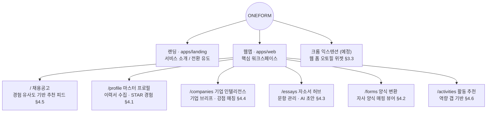
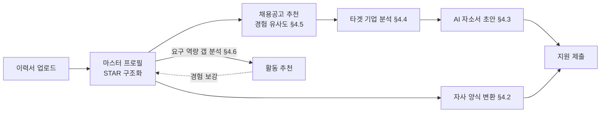
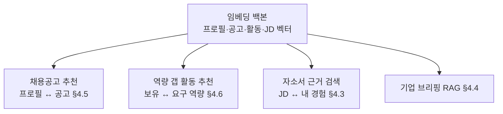

# one-form IA (Information Architecture)

기획서(`docs/기획서.md`) 기반. 현재는 목(mock) 단계 — web 6개 페이지 + 더미 API.

## 서비스 전체 구조

## 핵심 유저 플로우

## 임베딩 백본 (§3.4)

채용공고 추천·역량 갭 활동 추천·자소서 초안은 **하나의 임베딩 백본**을 공유한다.
프로필·채용공고·활동·JD를 같은 벡터 공간에 두어 여러 기능을 일관되게 파생시킨다.

## 페이지 ↔ 기획서 ↔ API 매핑

| 페이지 | 기획서 | 기능 (목 단계) | Mock API |
| --- | --- | --- | --- |
| `/` 채용공고 | §4.5 | 경험 유사도 기반 채용공고 추천 피드 (매칭 근거 표시) | `GET /api/jobs` |
| `/profile` 마스터 프로필 | §4.1, §5 | 이력서 업로드(수집 목), 기본 스펙, STAR 경험 카드 | `GET /api/profile` · `POST /api/profile/resume` |
| `/companies` 기업 인텔리전스 | §4.4, §5 | 기업명 입력 → 사업/제품/JD 역량/강점 매칭 브리프 | `POST /api/companies/analyze` |
| `/essays` 자소서 허브 | §4.3, §5 | 문항 목록(글자 수·마감), AI 초안 생성 | `GET /api/essays` · `POST /api/essays/draft` |
| `/forms` 양식 변환 | §4.2, §5 | 양식 업로드 → 필드 매핑 시뮬레이션 | `POST /api/forms/convert` |
| `/activities` 활동 추천 | §4.6 | 역량 갭 보완 활동 추천 — 예상 경험·기업/직무 연결 표시 | `GET /api/activities` |

- 홈(`/`)은 V5의 지원 상태 칸반 대신 **경험 유사도 기반 채용공고 추천 피드**다
  (칸반 트래킹은 후속 로드맵).
- MVP(§5) 중 '크롬 오토필 위젯'은 브라우저 익스텐션이라 web 범위 밖 — 후속 작업.

## Mock 규약

모든 목 엔드포인트는 DB 없이 **1초 지연 후 더미 데이터**를 반환한다
(`apps/backend/app/main.py`의 `mock()` 헬퍼). 지금은 유사도 점수·매칭 근거·역량 갭이
하드코딩된 더미이며, 실제 구현 시 임베딩 백본으로 교체한다 (`mock()` 호출만 걷어내면 된다).
