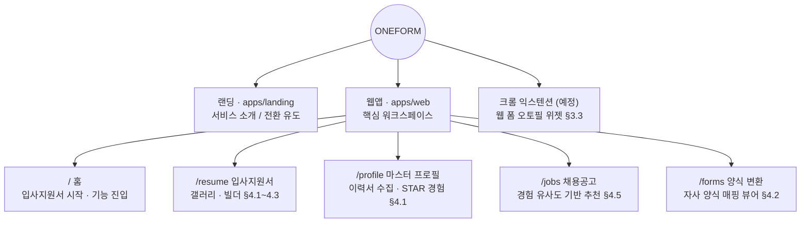
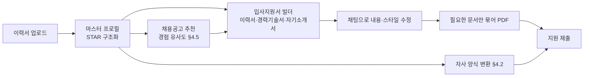
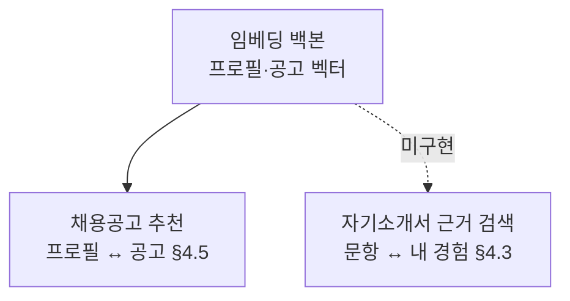

# one-form IA (Information Architecture)

기획서(`docs/기획서.md`) 기반. 기획서는 초기 구상이고, **이 문서가 현재 화면·API의 기준**이다.

## 서비스 전체 구조

## 핵심 유저 플로우

## 임베딩 백본 (§3.4)

프로필과 채용공고를 같은 벡터 공간에 두고, 코사인 유사도로 매칭률을 낸 뒤
상위 K개만 LLM이 보정·근거 생성한다(`app/jobs/service.py`). 자기소개서 근거 검색도
같은 백본을 쓸 자리지만 아직 목이다.

## 페이지 ↔ API 매핑

| 페이지 | 기능 | API |
| --- | --- | --- |
| `/` 홈 | 입사지원서 시작, 기능 진입 | (로컬 저장분만 읽음) |
| `/resume` 갤러리 | 저장한 입사지원서 목록·열기·삭제 | (localStorage `oneform.resumes`) |
| `/resume/new`, `/resume/edit/:id` 빌더 | 이력서·경력기술서·자기소개서 편집, 템플릿·자료·자소서 문항, 채팅 수정, PDF | `GET /api/resume/templates` · `GET /api/resume/seed` · `GET /api/resume/essay-questions` · `POST /api/resume/materials/extract` · `POST /api/resume/essay-draft` · `POST /api/resume/chat` · `POST /api/resume/preview` · `POST /api/resume/render` · `POST /api/resume/render-bundle` |
| `/profile` 마스터 프로필 | 이력서 PDF 업로드 → 구조화, 직접 편집 | `GET /api/profile` · `PUT /api/profile` · `POST /api/profile/resume` |
| `/jobs`, `/jobs/:id` 채용공고 | 매칭률·근거 피드 + 상세 매칭 분석 | `GET /api/jobs` · `GET /api/jobs/{id}` |
| `/forms` 양식 변환 | 양식 업로드 → 필드 매핑 | `POST /api/forms/convert` |
| `/notifications` 알림 | 알림 목록 | `GET /api/notifications` |

- 저장된 입사지원서는 아직 **브라우저 localStorage**에만 있다 — 서버 저장은 후속 작업.
- MVP(§5) 중 '크롬 오토필 위젯'은 브라우저 익스텐션이라 web 범위 밖 — 후속 작업.
- 기획서의 기업 인텔리전스(§4.4)·자소서 허브(§4.3)·활동 추천(§4.6)은 별도 화면을 걷어내고,
  자기소개서는 입사지원서 빌더 안으로 흡수했다(`docs/archive/` 참고).

## 데이터 소스 규약

profile·notifications·jobs는 `DATABASE_URL`이 있으면 PostgreSQL, 없으면 모듈 상수로
폴백한다 — 개발·CI가 DB 없이 돈다. forms만 아직 `app/core/mock.py`의 `mock()`
(지연 후 더미)이고, 실제 구현 시 그 호출만 쿼리로 바꾸면 된다.
